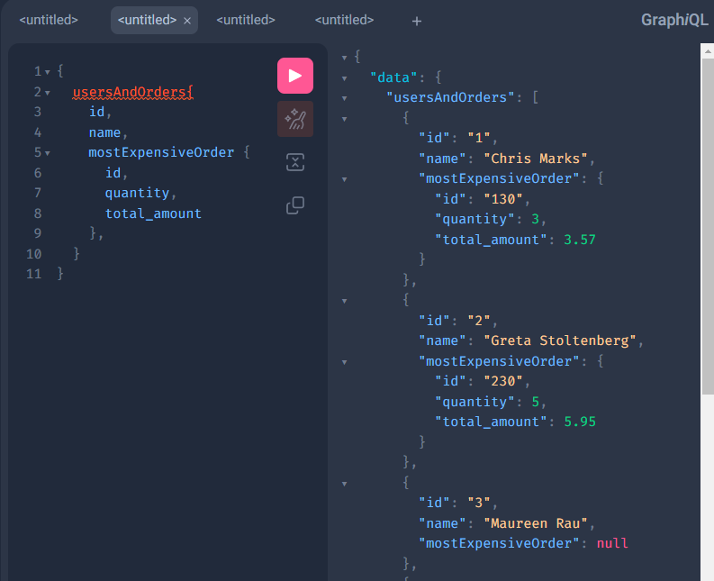
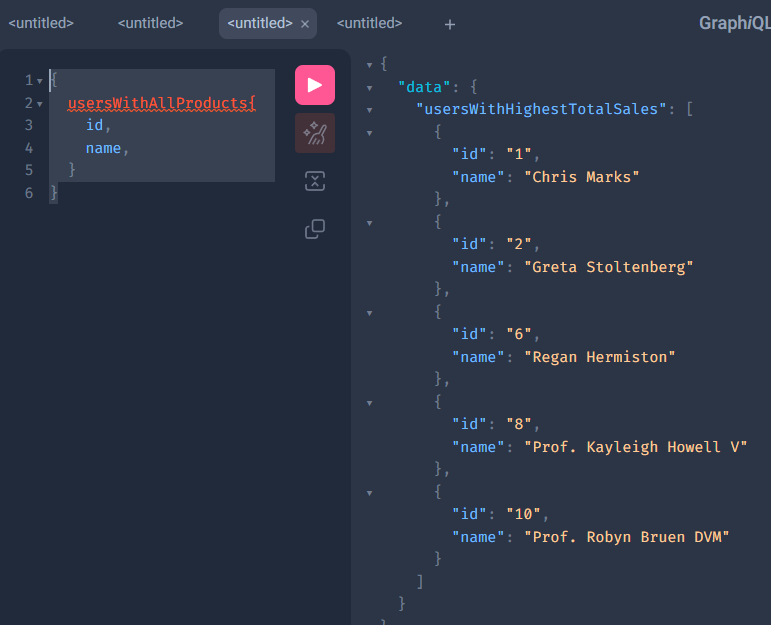
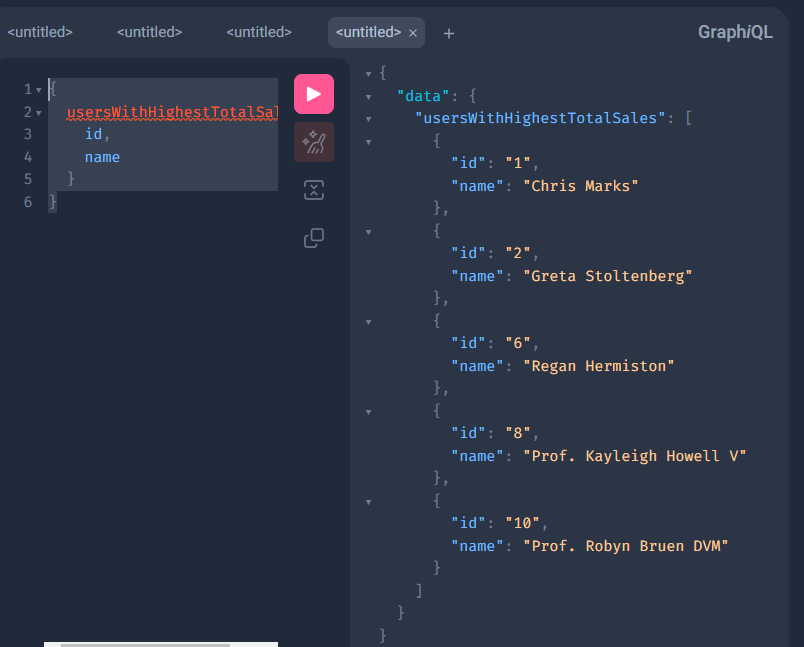

# Sergio's tech challenge
## Objective:
#### In this repo I implemented lighthouse which is a framework for handling graphql over laravel. It requires laravel, it does not include it. It could also require other libraries specified by them on https://lighthouse-php.com/ via composer.

## Instruction to run:
- 1: You have to bypass lighthouse domain in your /etc/hosts file (otherwise you will have to enter via 127.0.01).
- 2: You have to install composer in case you don't have it and run `run composer install` in the root folder of the project.
- 3: You have to install docker and docker-compose in case you don't have it and run `docker-compose up`.
- 4: Copy .env.example file to .env and make any configuraiton there if neccesary. By default, the site will start automatically on http://lighthouse without need to change anything.

## Explanation:
- 1: The docker compose file starts 3 containers: PHP-fpm 8.1, mysql5.7 and nginx alpine.
- 2: You can check in the docker-compose.yml file and in the docker folder the specific of the configuration of the containers.
- 3: The PHP dockerfile have the instructions for running the migrations and seeding of the DB when it builds the container. Remember that if you want to run the migrations or seeding after that you will have to connect to docker via `docker exec -it [YOUR_PHP_CONTAINER] /bin/bash` and then run `php artisan migrate` or `php artisan db:seed`.
- 4: You can find the graphql schema in `./graphql/schema.graphql` with the definitions of types and queries used to resolve the excercie that is below.

## Graphql Excercise
#### This challenge has 3 requirements for querying graphql and get different information. You can find the definition of the models in the models folder, the migration for it is `2023_07_12_125607_orders_products.php`. The seeder is using three factories created for generate products, and orders for users.
#### Here are the graph excercises statements and how to call them to perform the graphql queries on your local http://lighthouse/graphiql

### First Query: Retrieve Users and Their Most Expensive Order
#### Write an SQL query that retrieves the users and their most expensive orders.

#### This is the Graphql query:
````json
{
  usersAndOrders{
    id,
    name,
    mostExpensiveOrder {
      id,
      quantity,
      total_amount
    },
  }
}
````
#### Visual:


### Second Query: Retrieve Users Who Have Purchased All Products
#### Write a SQL query that retrieves users who have purchased all available products.

#### This is the Graphql query:
````json
{
  usersWithAllProducts{
    id,
    name,
  }
}
````
#### Visual:


### Third Query: Retrieve Users with Highest Total Sales
#### Write a SQL query that retrieves users with the highest total sales.   

#### This is the Graphql query:
````json
{
  usersWithHighestTotalSales {
    id,
    name
  }
}
````
#### Visual:


